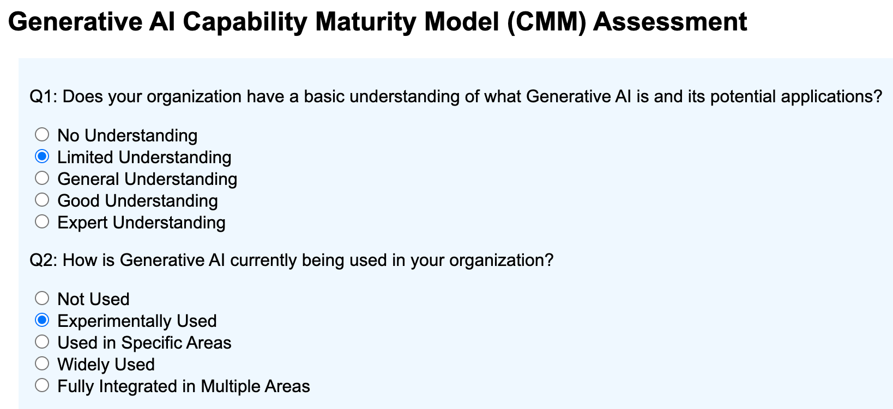

# Generative AI CMM Assessment




[Run the Sample GenAI CMM Survey Form](form-radio.html){ .md-button .md-button--primary }

In this section, we will learn how to use generative AI to create a web form you can use to do a simple placement on a 1-5 level of a capability maturity model (CMM).  This
is done in a few steps.

1. Get a list of 10 questions relevant to placement on the Generative AI CMM levels
2. Get multiple-choice results for each question
3. Generate an HTML form that has radio buttons for each question and the possible five answers
4. Generate some JavaScript to create a total score
5. Assemble the results in a HTML form with a "Calculate my GenAI CMM Level" at the end of the form

## Sample Prompts

### Getting Started

```linenums="0"
I am creating a process to help organizations understand
where they stand on a five-level capability maturity model (CMM)
for their use of generative AI (GenAI).
Can you please generate a 10-question assessment to help
an organization determine where they are on the a five-level CMM model?
```

### Sample Response

Certainly! A 10-question assessment for organizations to determine their position in a five-level Capability Maturity Model (CMM) for Generative AI (GenAI) use can be structured to evaluate various aspects such as awareness, integration, optimization, and innovation. The five levels could be:

1.  **Initial (Ad-hoc):** Basic understanding, no formal processes.
2.  **Managed:** Reactive approaches, some organized processes.
3.  **Defined:** Proactive strategies, standardized processes.
4.  **Quantitatively Managed:** Measured and controlled processes.
5.  **Optimizing:** Continuous improvement, leading-edge practices.

Here's a 10-question assessment:

### Assessment Questions

1.  **Awareness and Understanding:**

    -   Does your organization have a basic understanding of what Generative AI is and its potential applications?
    -   Options: No Understanding, Limited Understanding, General Understanding, Good Understanding, Expert Understanding.
2.  **Use of Generative AI:**

    -   How is Generative AI currently being used in your organization?
    -   Options: Not Used, Experimentally Used, Used in Specific Areas, Widely Used, Fully Integrated in Multiple Areas.
3.  **Policy and Governance:**

    -   Does your organization have policies or governance structures in place for the use of Generative AI?
    -   Options: None, Informal Guidelines, Formal Policies for Specific Cases, Comprehensive Policies, Dynamic Policies Reviewed Regularly.
4.  **Training and Expertise:**

    -   What level of training or expertise in Generative AI is available within your organization?
    -   Options: None, Basic Awareness, Some Trained Individuals, Dedicated Team with Expertise, Organization-Wide Expertise.
5.  **Data Management:**

    -   How does your organization manage data for Generative AI applications?
    -   Options: Ad-hoc/Unstructured, Basic Data Management, Systematic Data Management, Advanced Data Analytics, Leading-Edge Data Strategies.
6.  **Integration with Business Processes:**

    -   To what extent is Generative AI integrated into your business processes?
    -   Options: Not Integrated, Partially Integrated in Some Processes, Integrated in Several Key Processes, Highly Integrated, Core to Most Business Processes.
7.  **Innovation and Development:**

    -   Is your organization involved in developing new applications or innovations using Generative AI?
    -   Options: No Involvement, Limited Experimentation, Regular Development Projects, Strategic Development Initiatives, Industry-Leading Innovations.
8.  **Performance Measurement:**

    -   How does your organization measure the performance and impact of Generative AI technologies?
    -   Options: Not Measured, Informally Assessed, Regularly Measured for Specific Projects, Comprehensive Measurement Systems, Advanced Predictive Analytics and KPIs.
9.  **Risk Management:**

    -   How does your organization manage risks associated with Generative AI?
    -   Options: No Risk Management, Informal Risk Awareness, Basic Risk Management Processes, Advanced Risk Management Strategies, Leading-Edge Risk Management and Mitigation.
10.  **Future Orientation:**

    -   How is your organization preparing for future advancements in Generative AI?
    -   Options: Not Preparing, Limited Awareness of Future Trends, Proactive Monitoring, Strategic Planning for Future Trends, Leading the Development of Future Trends.

### Scoring

-   Allocate points from 1 (lowest maturity) to 5 (highest maturity) based on the options chosen. The total score will help categorize the organization into one of the five levels of the CMM for GenAI.

This assessment helps organizations understand their current maturity level in using Generative AI and identify areas for improvement.

```linenums="0"
Create a 10-question form that helps classify an organization
on the right five step CMM level for
the use of generative AI.
Each question has a five answer multiple choice question. 
The score of each question is assigned
a level of 1 to 5.
At the end of the form, a total score is tallied
and the range should be a level from 1 to 5.
Make sure to use radio buttons for each question so that
all the options for each question are clearly visible as you scroll through
the form.
```

## Sample Result

[Sample Single Radio](form-radio.html)

[Survey Version 1](genai-cmm-survey.html)

## References

[Sample ChatGPT Dialog](https://chat.openai.com/share/395c8222-9e97-4a01-b5f4-91f461aa6b3f)